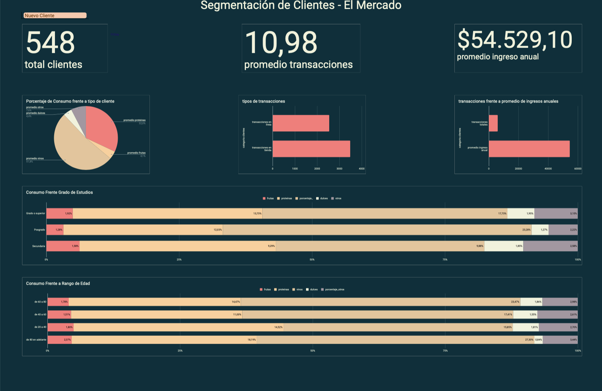

# Segmentacion-Clientes-RFM

Ficha Técnica: Proyecto de Análisis de Datos

Título del Proyecto: Segmentación de clientes mediante RFM

Objetivo:
Aplicar segmentación de clientes a una base de datos, utilizando una tecnica de analisis de datos(RFM)

Equipo:
Trabajo individual.

Herramientas y Tecnologías:
- Hojas de cálculo(Google Sheets).
- Google Slides.
- Looker Studio

Procesamiento y análisis:
- limpieza de datos
- exploración de datos
- formulas de excel
- Técnica de Análisis de datos
  
Resultados y Conclusiones:
Se cuantificó el problema mediante una tasa promedio de transacciones por las categorías de clientes generadas tras un análisis estadístico utilizado para la segmentación de clientes. Según la categoría más frecuente, la de "cliente leal", se observó un impacto económico en la tasa promedio de transacciones y se plantearon escenarios de ahorro para mejorar dicha tasa.

Dashboard

Limitaciones/Próximos Pasos:
Identifica y describe cualquier limitación o desafío encontrado durante el proyecto.
Sugiere posibles próximos pasos para extender o mejorar el proyecto de análisis de datos.

Enlaces de interés:
[google sheet](https://docs.google.com/spreadsheets/d/1qn7SPjSuHOGm4xZun-MMXCd443GUnjpBADodIH2a2yQ/edit?usp=sharing)
[google slide](https://docs.google.com/presentation/d/10Ef_mPVaNG1hU6ojk-B2-PSHzNEK9bZ1JDlT8aFFFb4/edit?usp=sharing)
[looker studio](https://lookerstudio.google.com/reporting/e3385dcb-43aa-4809-a45f-e79fddc633b4)
